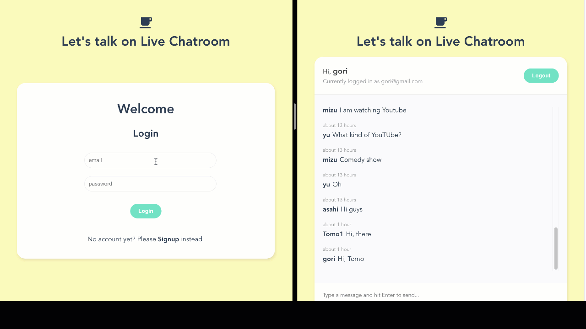

# Live Chatroom Built With Vue

Developed a live chat app with VueJS, Firebase Firestore, and Firebase Auth.
After registering your name, email, and password, you can chat live with other users.
Your authentication is handled by Firebase Auth securely.



## Table of Contents

- [Built With](#built-with)
- [Live Demo](#live-demo)
- [Getting Started](#getting-started)
- [How to run the app](#how-to-run-the-game)
- [Author](#author)
- [Show your support](#show-your-support)
- [License](#license)
<!-- - [Acknowledgements](#acknowledgements) -->

## Built With

- Vue.js (Vue3)
- Firebase Firestore
- Firebase Authentication

## Live Demo

[Live Demo Link](https://live-chat-yocosaka.netlify.app/)

## Getting Started

To get a local copy up and running follow these simple example steps.

1. On the project GitHub page, navigate to the main page of the repository.
2. Under the repository name, locate and click on a green button named `Code`.
3. Copy the project URL as displayed.
4. If you're running the Windows Operating System, open your command prompt. On Linux, Open your terminal.
5. Change the current working directory to the location where you want the cloned directory to be made. Leave as it is if the current location is where you want the project to be.
6. Type git clone, and then paste the URL you copied in Step 3. <br>
   e.g. $ git clone https://github.com/yourUsername/yourProjectName
7. Press Enter. Your local copy will be created.
<!-- 8. To run the app, run `npm run serve` or `yarn serve` -->

## How to run the app

1. After cloning or downloading this repository, Run `npm install` or `yarn install`
2. create a new file with the name `.env` in the project root
3. Add Firebase Authentiication Information to `.env` file like below:

```
VUE_APP_FIREBASE_API_KEY<-- Input Firebase API key here -->
VUE_APP_FIREBASE_AUTH_DOMAIN=<-- Input Firebase auth domain here -->
VUE_APP_FIREBASE_PROJECT_ID=<-- Input Firebase project ID here -->
VUE_APP_FIREBASE_STORAGE_BUCKET=<-- Input Firebase storage bucket here -->
VUE_APP_FIREBASE_MESSAGING_SENDER_ID=<-- Input Firebase messaging sender ID here -->
VUE_APP_FIREBASE_APP_ID=<-- Input Firebase API ID here -->
VUE_APP_FIREBASE_MEASUREMENT_ID=<-- Input Firebase measurement ID here -->

```

4. Run `yarn serve`, then the local server will be automatically opened
5. Run `yarn build`to generate the production file in `dist` folder

## Author

👤 **Yoko Saka**

- GitHub: [@yocosaka](https://github.com/yocosaka)
- LinkedIn: [Yoko Saka](https://www.linkedin.com/in/yokosaka)

## Show your support

Give a ⭐️ if you like this project!

## License

This project is [MIT](./LICENSE) licensed.
The original design and architecture of the app are provided by [Shaun Pelling](https://www.youtube.com/channel/UCW5YeuERMmlnqo4oq8vwUpg).
